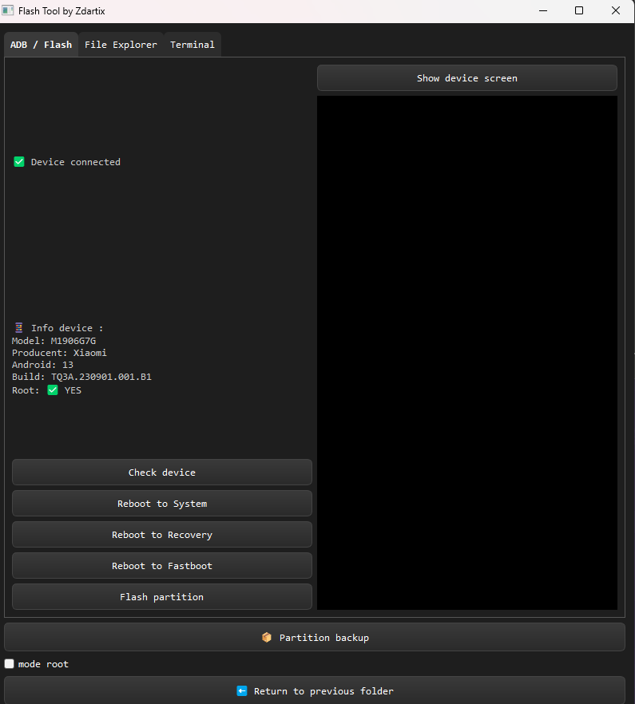

# 🔥 Zdartix Flash Tool

**Zdartix Flash Tool** is a lightweight GUI-based Android flashing tool using ADB and Fastboot.  
No global installation required – everything runs locally from the `platform-tools` folder.

---

## ✨ Main Features

- Flash partitions: `boot`, `recovery`, `vbmeta`, `system`, `vendor`, `dtbo`, `userdata`
- Create partition backups using `adb shell dd`
- Built-in file editor (automatically pulls > edits > pushes the file)
- Integrated terminal/console with real-time feedback
- File explorer via ADB (supports read/write operations and file info)
- ADB & Fastboot run locally – no need to add them to PATH
- Stylish dark interface
- `.exe` installer with icon and desktop shortcut

---

## 💡 Highlights

- 🧠 **No terminal knowledge needed** – all tasks can be performed via GUI
- ⚡ **No need to install ADB/Fastboot globally** – uses local executables
- 💾 **One-click partition backup** – select partitions and save `.img` files easily

---

## 🧭 File Explorer

Allows you to:

- Browse Android file system using ADB
- Create, delete, rename files/folders
- Edit text files (with automatic pull/edit/push cycle)
- Copy and paste files across folders
- View file information
- Toggle basic or advanced mode (read/write)

Works on both internal storage and system partitions.

---

## 💻 Terminal / Console

Every command executed via ADB or Fastboot is displayed in a styled output console:

- Logs `adb shell`, `adb pull`, `fastboot flash`, etc.
- Instant feedback from the connected device
- Color-coded output:
  - ✅ Green: Success
  - ⚠️ Yellow: Warnings
  - ❌ Red: Errors
  - 📘 Blue: System Info

---

## 🚀 Requirements

- Windows 10 or 11
- ADB/Fastboot drivers installed (or device in Fastboot mode)

---

## 📄 License

MIT License – do what you want with it, just don’t claim it’s yours 😎  
See [LICENSE](LICENSE).

---

## 📥 Installation

1. Download the latest installer from the [Releases](https://github.com/Zdartix/Zdartix-Flash-Tool/releases) section.
2. Run the `.exe` file.
3. Follow the setup wizard.
4. Done – launch from desktop shortcut or Start Menu! ✅

---

## 👨‍💻 Author

**Zdartix**  
📧 kontakt@zdartix.pl  
📍 Poland

---

## 🛠️ Status

**🧪 Early Access | Testing Version**  
Upcoming features: `.zip` ROM flashing, automatic updates, more advanced tools.

---

## 🙏 Acknowledgements & Dependencies

This project uses:

- [**platform-tools** (ADB & Fastboot)](https://developer.android.com/studio/releases/platform-tools) – official tools by Google for Android
- [**scrcpy**](https://github.com/Genymobile/scrcpy) – an amazing open-source Android display/remote control tool

Huge thanks to the creators of these tools – without them, this project wouldn't exist. ❤️
